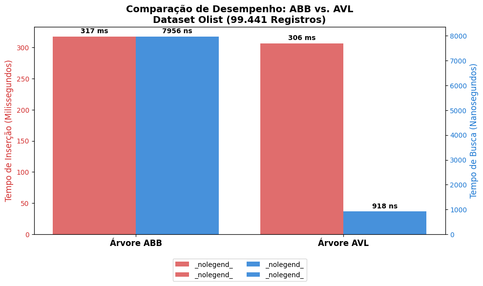

# Projeto 2: Comparativo de Performance entre Árvore Binária (ABB) e Árvore AVL

[cite_start]Este projeto foi desenvolvido para a disciplina de **Algoritmos e Programação** do Programa de Pós-Graduação em Computação Aplicada (PPGCA) da **Universidade Presbiteriana Mackenzie**[cite: 1, 2, 3].

## 🎯 Objetivo do Projeto
[cite_start]Analisar a eficiência de algoritmos de busca e inserção em estruturas de dados não lineares, utilizando um volume real de dados (Dataset Olist - E-commerce com ~100 mil registros)[cite: 18, 22, 56].

## 🛠️ Ambiente e Tecnologias
* **Hardware:** Intel Core i7-5500U @ 2.40 GHz | [cite_start]8 GB RAM[cite: 8, 9].
* [cite_start]**Linguagem:** Python 3 (Ambiente Google Colab)[cite: 13, 21].
* [cite_start]**Estruturas:** Árvore Binária de Busca (ABB) e Árvore AVL (Auto-balanceada)[cite: 24, 44, 45].

## 📊 Resultados de Performance
[cite_start]Os testes práticos confirmaram a eficiência da árvore balanceada para grandes datasets[cite: 102]:

| Métrica | Árvore ABB (Simples) | Árvore AVL (Balanceada) | Ganho de Performance |
| :--- | :--- | :--- | :--- |
| **Inserção Total** | [cite_start]317 ms [cite: 40, 48] | [cite_start]306 ms [cite: 41, 49] | [cite_start]Superior (AVL) [cite: 62, 112] |
| **Busca (ID Final)** | [cite_start]7.956 ns [cite: 40, 52] | [cite_start]918 ns [cite: 41, 53] | [cite_start]**~8,6x mais rápida** [cite: 54, 98, 110] |

## 💡 Análise do "Pulo do Gato"
* [cite_start]**Eficiência na Inserção:** A AVL foi mais rápida (306 ms) porque a árvore mantida em menor altura agiliza a localização do ponto de inserção, compensando o custo das rotações[cite: 60, 62, 109, 117].
* [cite_start]**Previsibilidade:** Enquanto a ABB demonstra sinais de degeneração (tendendo a $O(n)$), a AVL garante a complexidade logarítmica $O(\log n)$ e mantém o sistema escalável[cite: 58, 103, 118].
* [cite_start]**Índice Secundário:** Implementação de uma segunda árvore AVL indexada pelo campo `price`, permitindo buscas instantâneas por critérios multidimensionais[cite: 68, 77, 78, 83].

## 🎓 Autor
* [cite_start]**Sérgio Guedes Fraga** [cite: 5]
* **Orientadora:** Profa. Dra. [cite_start]Valéria Farinazzo Martins [cite: 4]
